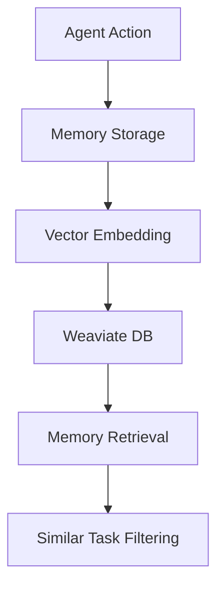

import { Callout } from "@/components/ui/callout";
import { Card } from "@/components/ui/card";

# Memory Management

AI agents in Allinix need to maintain context of their previous actions while executing tasks. However, they face a fundamental limitation: their memory is constrained by their context length (approximately 8k tokens for GPT models).

<Callout type="info">
  The context length limitation means agents can't retain unlimited history of
  their actions. This is where vector databases come in as a solution for
  long-term memory storage.
</Callout>

## The Memory Challenge

When agents run multiple execution loops, they encounter two main issues:

1. Limited context window in language models
2. Need to access historical decisions and actions

Our solution leverages vector databases to store and retrieve memory externally, making it available when needed.

## Vector Databases Explained

<Card>
  

    <h3 className="font-semibold mb-2">What is a Vector Database?</h3>
    

      A vector database stores and retrieves data based on semantic similarity
      rather than exact matching. This makes it perfect for storing AI memory
      because:
    

    <ul className="list-disc pl-6 mt-2">
      <li>It can find relevant memories based on context</li>
      <li>It enables efficient similarity search across large datasets</li>
      <li>It works similarly to human memory retrieval</li>
    </ul>
  

</Card>

For a comprehensive understanding, you can refer to the [Weaviate documentation](https://weaviate.io/developers/weaviate).

## Why We Chose Weaviate

Weaviate serves as our primary vector database for several compelling reasons:

<Card>
  

    ### Key Benefits 1. **Open Source & Accessible** - Runs locally via
    docker-compose - No API key required for local development 2. **Scalable
    Cloud Solution** - Managed service available - Automatic scaling based on
    workload - Minimal infrastructure management 3. **Integration Support** -
    Seamless LangChain integration - Rich API ecosystem - Active community
    support
  

</Card>

<Callout type="info">
  While Weaviate is our current choice, we're open to community suggestions.
  Feel free to create a ticket or pull request if you have alternative database
  recommendations.
</Callout>

## Current Memory Implementation

Our long-term memory system is actively evolving. Here's what we've implemented so far:

### Current Features

- Task similarity detection and filtering
- Historical context retrieval
- Persistent memory across sessions

<Callout type="warning">
  Memory management in Allinix is still under active development. We welcome
  contributions and ideas from the community to enhance its capabilities.
</Callout>

## Contributing

If you're interested in improving Allinix's memory management:

1. Explore our current implementation
2. Share your ideas through GitHub issues
3. Submit pull requests with enhancements
4. Join our community discussions

<Card>
  

    <h3 className="font-semibold mb-2">Future Development Areas</h3>
    <ul className="list-disc pl-6">
      <li>Enhanced memory pruning algorithms</li>
      <li>Improved relevance scoring</li>
      <li>Memory compression techniques</li>
      <li>Multi-agent memory sharing</li>
    </ul>
  

</Card>
